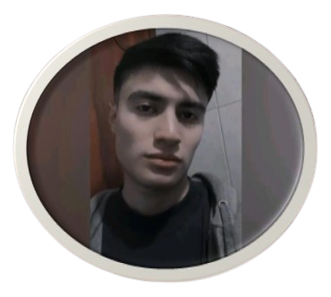

# ¡Hola! 👋 Soy Anthony Goyes

¡Bienvenido a mi portafolio en GitHub!

## Sobre mí
Soy un apasionado de la tecnología y el desarrollo de software. Actualmente soy estudiante de cuarto semestre de la carrera de Ingeniería en Ciencias de la Computación en la Universidad EPN. Mis áreas de interés incluyen el desarrollo de software, redes de computadoras y el aprendizaje de idiomas.

  

## Habilidades
- Lenguajes de programación: C++, Java, Python (en proceso de aprendizaje).
- Redes de computadoras: Fundamentos de redes.
- Idiomas: Inglés Academic 1 certificado por el Centro de Capacitación Continua EPN. Certificado de Inglés: [Enlace al Certificado](https://drive.google.com/file/d/1wwSCTSQqXVUCyB3Vbd5aCGXAhM8w4qoq/view?usp=sharing)

## Proyectos destacados
Aquí hay algunos proyectos en los que he trabajado recientemente:

1. **Implementación de una red para un hotel temático de Disney con dos sucursales**:
   Este proyecto, realizado en grupo, consistió en la implementación de una red en Packet Tracer para un hotel temático de Disney con dos sucursales. Contribuí al diseño y configuración de la red, así como a la interconexión de las sucursales para garantizar una comunicación fluida y segura entre ambas sedes.
   [Enlace al informe del proyecto](https://drive.google.com/file/d/1OIXNVtFKbT9qtU4WNRiKfsloTUz-fWMu/view?usp=sharing)

3. **Contador de estudiantes aprobados y reprobados en lenguaje MIPS Assembler**:
   Desarrollé un código en lenguaje MIPS Assembler que, dado un número de estudiantes y sus calificaciones, determinaba el número de estudiantes aprobados y reprobados. Este proyecto me permitió profundizar mis conocimientos en lenguajes de bajo nivel y en la manipulación de datos.
   [Enlace al informe del proyecto](https://drive.google.com/file/d/1IGKHHFoKe2tfWKuxKIqmzTGUkRPcFQ_v/view?usp=sharing)

## Contacto
¡Me encantaría conectar contigo! Puedes encontrarme en [mi perfil de GitHub](https://github.com/anthonypgq) o en mis redes sociales.

## Intereses personales
Aparte de la tecnología, soy un apasionado del fútbol, tanto verlo como jugarlo. También disfruto de descubrir nueva música y conocer nuevos lugares.

¡Gracias por visitar mi portafolio!
